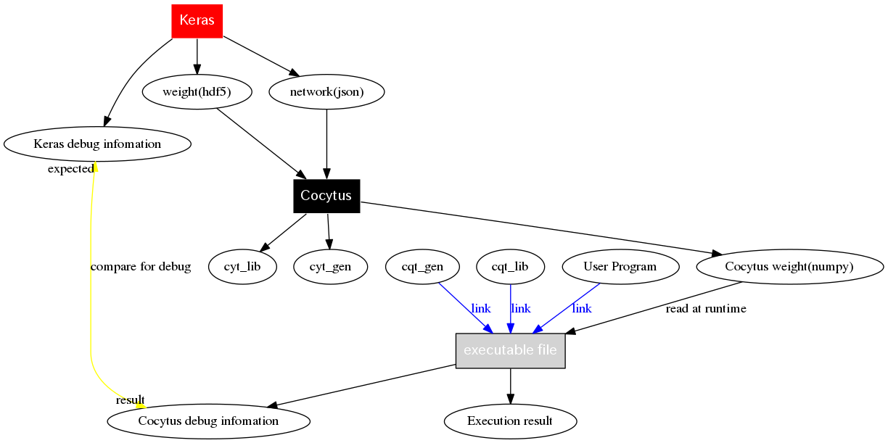

# はじめに
コキュートスとは、組込向けDeep Learningフレームワークである。Ｋｅｒａｓから、ネットワーク構成と学習結果を読みだし、移植性の高いＣソースコードを生成する。コキュートスは以下の特徴を持つ。
- 組込み向けＣソースコードの生成機能
- 生成されたＣソースとＫｅｒａｓの出力を比較するデバッグ機能

本マニュアルは、コキュートスの使用方法について記述したものである。

# コキュートスとは
## コキュートスの特徴


## コキュートスの処理手順

コキュートスの処理手順を以下に示す。



以下の順序で処理を行う。

- 最初にＫｅｒａｓでネットワークの定義、および学習を行う。
- Kerasからネットワークの情報をjson形式で、重みデータをhdf5形式で出力する。
- コキュートスは2つのファイルを読み込み、コキュートス初期設定ファイル(Cqt_gen)、コキュートスライブラリ(Cqt_lib)、コキュートス重みファイル(numpy形式)を生成する。
- コキュートス初期設定ファイル(Cqt_gen)、コキュートスライブラリ(Cqt_lib)と、ユーザープログラムをリンクし、実行ファイルを作成する。
- 実行時にはコキュートス重みファイルを読みこみ、ＮＮを動作させる。
- 必要に応じて、Ｋｅｒａｓの出力と、コキュートスの出力を比較する事ができる。

# 使い方

## 起動方法
コマンドラインからcocytus.pyを実行する。
```
python cocuytus.py [options] iniファイル
```
コマンドラインのオプションと、iniファイルでは同じ内容を指定でき、内容が重複する場合はコマンドラインによる指定が優先される。


## オプション一覧
オプションの一覧を以下に示す。表中、空欄の箇所は対応するオプションが存在しないことを示す。

Table: オプション一覧

| オプション名 | コマンドラインオプション| iniファイルセクション|iniファイルエントリー |設定例|内容|
|:-----------|:------------|:------------|:------------|:------------|:--------|
| ネットワーク指定| --keras_json | [Cocyuts] | keres_json | "~/foo/baa.json" | 変換するネットワーク(jsonファイル)を指定する。（必須)|
| 重み指定| --keras_weight | [Cocyuts] | keras_weight | "~/foo/baa.h5" | 変換する重み(hdf5ファイル)を指定する。（必須)|
| 出力ディレクトリ | --output_dir | [Cocyuts] | output_dir | "~/proj/" | ファイルの出力先（必須)|
| 重み出力ディレクトリ| --weight_output_dir | [Cocyuts] | weight_output_dir | "~/proj/weight/" | コキュートス重みファイルの出力先。省略されるとコキュートス重みファイルを生成しません。|
| 最適化レベル| --optimize | [Optimize] | optimeize | 2 | ニューラルネットの最適化レベルの指定。０で最適化をしない（デフォルト値）。未実装|
| バージョン表示| --version |  |  |  | コキュートスのバージョンを表示し終了する。|

## iniファイル例


# ディレクトリ構成

- cocytus
    - *<b>cocytus.py</b>*
    - compiler
        - *<b>compiler.py</b>*
    - cocytus_net
        - acivation
        - convolution
        - etc..
    - weight_converter
    - util
- test
    - *<b>test.py</b>*
    - python_test
    - c_test
- doc
    - manual マニュアル
    - spec　　仕様書
    - users_guide ユーザーズガイド

- tools
- example
    - mnist_cnn
    - vgg16

参考：
http://www.hexacosa.net/pph_ja/